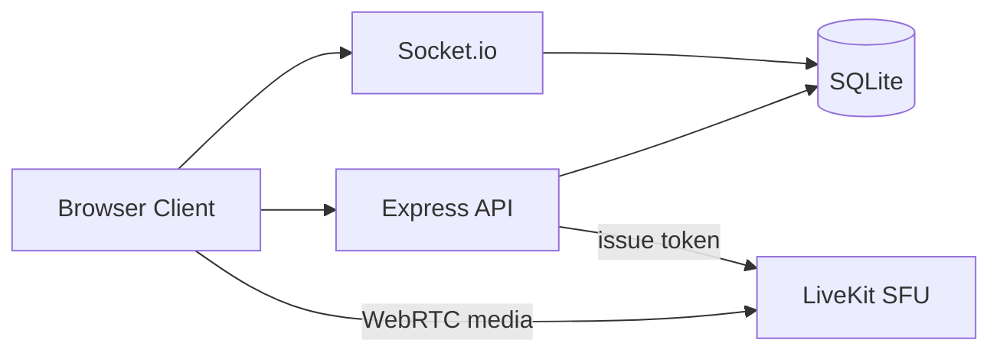

# Apex Classroom

Self-hosted video conferencing and virtual classroom platform — LiveKit-powered meetings with chat, whiteboard, polls, breakout rooms, and session analytics. Built as a Zoom-style alternative for education and small teams.

**Live:** [apexclassroom.duckdns.org](https://apexclassroom.duckdns.org)

---

## Table of Contents

- [System Design](#system-design)
- [Features](#features)
- [Technology Stack](#technology-stack)
- [Architecture](#architecture)
- [Getting Started](#getting-started)
- [Configuration](#configuration)
- [Deployment](#deployment)
- [Project Structure](#project-structure)
- [License](#license)

---

## System Design

Apex uses a **hybrid real-time architecture**: signaling and application state run over **Socket.io**, while media flows through **LiveKit SFU** (Selective Forwarding Unit) so the Node server never relays video bandwidth.



| Layer | Responsibility |
|-------|----------------|
| **Express** | REST auth, room CRUD, scheduling, attendance export, file upload metadata |
| **Socket.io** | Real-time chat, whiteboard sync, polls, reactions, breakout coordination |
| **LiveKit** | Video, audio, screen share, simulcast, device selection |
| **SQLite** | Users, sessions, attendance, chat history, whiteboard snapshots |

---

## Features

- **LiveKit WebRTC** — HD video/audio, screen share, layouts, PiP, fullscreen
- **Collaboration** — In-meeting chat with file sharing, collaborative whiteboard, screen annotations
- **Engagement** — Polls, breakout rooms, reactions, captions, focus/green-room modes
- **Identity** — Email/password auth, Google OAuth, JWT sessions, password-protected rooms
- **Scheduling** — Session calendar, ICS export, email invites (Nodemailer)
- **Analytics** — Attendance tracking, session stats, chat/attendance CSV export
- **Host dashboard** — Upcoming and scheduled meetings at a glance

---

## Technology Stack

| Component | Technology |
|-----------|------------|
| Backend | Node.js, Express, Socket.io |
| Media | [LiveKit](https://livekit.io/) SFU |
| Database | better-sqlite3 (SQLite) |
| Frontend | Vanilla ES modules (no framework) |
| Auth | JWT, Google OAuth 2.0 |
| Email | Nodemailer |

---

## Architecture

```
apex/
├── server.js          # Express + Socket.io + LiveKit token API
├── database.js        # SQLite schema and queries
├── setup.sh           # EC2 bootstrap (Node 20, PM2, LiveKit)
└── public/
    ├── index.html
    ├── styles.css
    └── src/           # Client modules
        ├── core.js, media.js, webrtc.js, livekit.js
        ├── chat.js, whiteboard.js, polling.js, breakout.js
        └── ui.js, overlay.js
```

---

## Getting Started

### Prerequisites

- Node.js 18+
- A running **LiveKit server** (local or cloud) — see [LiveKit docs](https://docs.livekit.io/)

### Install and run

```bash
git clone https://github.com/iamroidev/apex.git
cd apex
npm install
npm start
```

Open **http://localhost:3000**

---

## Configuration

Create a `.env` file in the project root:

| Variable | Required | Description |
|----------|----------|-------------|
| `PORT` | No | HTTP port (default `3000`) |
| `JWT_SECRET` | **Yes** | Random secret for session tokens |
| `LIVEKIT_API_KEY` | **Yes** | LiveKit API key |
| `LIVEKIT_API_SECRET` | **Yes** | LiveKit API secret |
| `LIVEKIT_WS_URL` | **Yes** | LiveKit WebSocket URL (e.g. `ws://localhost:7880`) |
| `GOOGLE_CLIENT_ID` | For OAuth | Google OAuth client ID |
| `GOOGLE_CLIENT_SECRET` | For OAuth | Google OAuth client secret |
| `ALLOWED_ORIGINS` | Prod | Comma-separated CORS origins |
| `PUBLIC_HOST` | Prod | Public hostname for invite links |
| `EMAIL_USER` | Optional | SMTP user for invites |
| `EMAIL_PASS` | Optional | SMTP password |

Generate a secure JWT secret:

```bash
node -e "console.log(require('crypto').randomBytes(32).toString('hex'))"
```

---

## Deployment

Production uses **AWS EC2** with PM2 and a co-located LiveKit instance.

```bash
chmod +x setup.sh
./setup.sh
```

The bootstrap script installs Node 20, PM2, LiveKit, and writes a starter `.env`. The app is served at **https://apexclassroom.duckdns.org**.

---

## License

MIT — see [LICENSE](LICENSE) if present.

**Author:** [iamroidev](https://github.com/iamroidev) · Richard Kwaku Opoku
